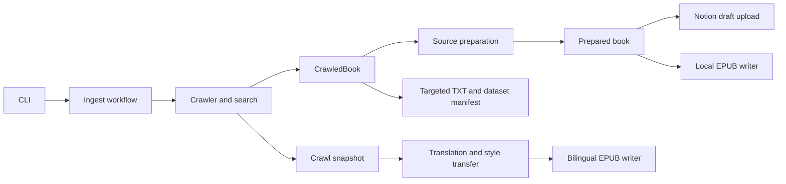

# Architecture

The production pipeline collects source material, prepares editable content, then
chooses a destination. Collection, Notion storage and local EPUB rendering have
separate interfaces.

## Ownership

| Module | Responsibility | Main entry points |
| --- | --- | --- |
| `crawler/` | Site parsing, browser/parallel fetch, search/previews, reusable snapshots | `registry.find_parser`, `ParserSpec.crawl`, `snapshot` |
| `content/` | Shared chapter models, source cleanup, explicit headings/emphasis/alignment | `prepare.prepare_source`, `normalization.normalize_member` |
| `epub/` | Local archive creation, XHTML presentation, validation and existing-edition repair | `writer.export_local`, `bilingual.create_bilingual_book`, `maintenance.normalize_new_epub` |
| `notion/` | OAuth/API transport, import decisions, duplicate review, upload checkpoints and cover orchestration | `upload.upload_source`, `upload.upload_draft` |
| `translation/` | Glossary/comment evidence, translation, style transfer, semantic QA and joining translations to snapshots | `pipeline`, `output.build_bilingual_epub` |
| `dataset/` | Targeted TXT export, classification and manifest maintenance | `library.upsert_txt_dataset_entry`, `library.export_single_epub_txt` |
| `metadata/` | Authoritative source lookup and book classification | `catalog.MetadataLookup`, `jjwxc`, `classifier` |
| `workflows/` | Join collection, preparation and output selection | `ingest.ingest`, `ingest.OutputOptions` |
| `runtime/` | Output paths, atomic state files, hashes and progress | `paths`, `files`, `progress` |
| `cli/` | Argument parsing and command dispatch | Installed commands in `pyproject.toml` |

Notion schema, Markdown encoding/decoding, paginated reads and writes live in the
versioned `notion-books` dependency. Its Python adapter calls back into this
project's authenticated transport. The importer maps its prepared chapter tree
to Notion rows, supplies its language default, and explicitly selects the
editorial-view contract to preserve complete content and manual chapter order.
Dependency upgrades update this project's version/tag and lockfile, then run its
own verification against the pinned release.

Paths in this table are relative to `src/`. Dependencies point toward the shared
contracts and services, never back into `cli/`. Production does not import the
independent `research/` project. `tests/test_architecture.py` checks the module
boundaries and keeps renderers separate from source cleanup and remote services.

## Contracts and output selection

`CrawlOptions` contains request/browser controls. A provider returns a
`CrawledBook`: title, author, ordered `Volume`/`Chapter` objects, source URL,
intro and optional cover bytes. It has no output path or Notion configuration.
`OutputOptions` belongs to the workflow: explicitly selected EPUB, Notion draft
and/or TXT. Repeat the output flag to combine destinations; `both` remains the
EPUB + TXT alias. An explicit output path can select its format, and a missing
choice stops before collection. `IngestResult` records each actual output path
and Notion checkpoint, so dataset updates never guess a TXT path from enriched
EPUB metadata.

`content.prepare` resolves source wording and formatting before either Notion or
local EPUB output. The prepared book contains:

- `metadata`: title, creator, language, source, description, subjects and series.
- `sections`: an ordered tree whose groups have `title`/`children`, and leaves
  refer to a chapter `member`.
- `chapters`: chapter titles and editable block lists keyed by member.
- `extras`: independent shared-extra candidates in source order.

Blocks carry kind, rich-text runs, heading level and optional alignment.
Renderers follow these properties without interpreting phrases in the prose.
The reading CSS lives in `content/styles.py`; H3 is `1.1em`, independent of
alignment. Covers are thumbnail assets without a separate reading page.

Notion stores prepared chapters in the book-owned database and independent
extras in the shared library. Notion schema and recovery details live in
[notion-books.md](notion-books.md). The local writer consumes the same prepared
book directly, validates a candidate EPUB, then backs up and atomically replaces
an observed destination. It neither authenticates with nor reads from Notion.

Z-Library returns a `DownloadedEdition` instead of editable crawl chapters.
The workflow requires explicit EPUB/TXT output, repairs a temporary candidate
before replacing an existing edition, and keeps the repair report at the final
output's report path. TXT-only output extracts from the downloaded edition.

Translation consumes persisted snapshots and reviewed book specs. Its output
adapter joins original blocks and translated paragraphs; `epub/bilingual.py`
owns EPUB construction. The translation workflow then explicitly runs its
existing metadata/normalization review. Translation, style-transfer and glossary
semantics are unchanged by the module reorganization.

## Maintenance versus presentation

Existing-edition repair is explicit:

- `content/normalization.py`: text/XHTML rules and findings.
- `epub/normalize.py`: inspect and rewrite archive members and navigation.
- `epub/review.py`: resolve ambiguous findings through Codex, preserving cached decisions.
- `epub/metadata.py`: inspect and update package metadata using `metadata/catalog.py`.
- `epub/reports.py`: persistent findings and repair history.
- `epub/maintenance.py`: combine those steps for the maintenance commands.

These repair stages are not invoked by the prepared-content EPUB renderer.
Site-specific cleanup stays in providers; shared wording/formatting rules stay
in source preparation. A presentation change belongs in the EPUB renderer or
`notion-books` content codec and must work for arbitrary text.

## Removed paths

The old native-page migration and Notion-to-local publishing flows have been
removed, along with `notion_books/`, `fanwai/`, obsolete per-book mapping files
and `book-fanwai`. The active draft uploader is `notion/upload.py`.

The duplicate legacy EPUB writer, provider-specific CLI forwarding functions,
unused EPUB outline-import helpers and unused `.env` loader were also removed.
Use the installed CLI commands; there are no compatibility wrappers for old
internal Python module paths. Existing crawl snapshots, translation artifacts,
Notion upload checkpoints and reader files retain their formats and locations.
